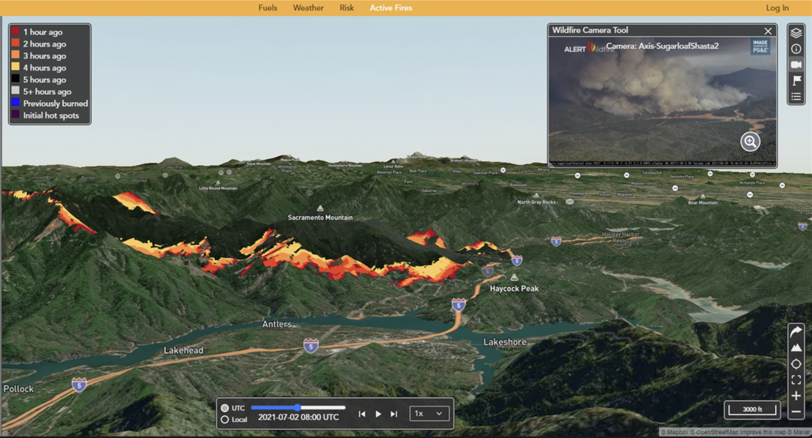

=================================================
ELMFIRE - Eulerian Level set Model of FIRE spread
=================================================

ELMFIRE is an operational wildland fire spread model used by fire agencies,
researchers, and engineers to model how wildfires grow across real landscapes.
It couples the Rothermel and CFFDRS surface spread formulations with a
level-set front-tracking method, and runs efficiently in parallel from a laptop
up to a large compute cluster.

As part of the `Pyrecast project <https://pyrecast.org>`_, ELMFIRE forecasts the
spread of most large fires in the Continental US.

This site is the ELMFIRE User Guide. It covers configuration and day-to-day
use, the mathematical formulation behind the model, the full input parameter
reference, and the verification and validation cases the model is tested
against.

What ELMFIRE can do
===================

* **Real-time forecasting** - predict where an active fire will spread.
* **Historical reconstruction** - reconstruct the spread of past fires.
* **Fire behavior potential** - quantify landscape-scale spread, fireline
  intensity, flame length, and crown fire potential.
* **Risk assessment** - estimate annual burn probability and fire severity
  through :ref:`Monte Carlo simulation <randomized-ignition>`.
* **Spotting, smoke, and WUI** - model :ref:`ember transport <spotting>`,
  :ref:`smoke emissions <smoke>` for HYSPLIT, and
  :ref:`structure-to-structure spread <building-spread>` in the
  wildland-urban interface.
* **Suppression** - represent the effect of :ref:`initial and extended attack
  <suppression>` on fire growth and containment.

ELMFIRE ingests standard gridded inputs - fuels, topography, weather, and
moisture as GeoTIFFs - and produces georeferenced raster outputs such as time
of arrival, fireline intensity, spread rate, and flame length.

Getting started
===============

ELMFIRE runs on Linux; Windows users can run it under WSL2. In outline:

#. Install the build prerequisites (compiler, MPI, GDAL, Python tooling).
#. Clone `the repository <https://github.com/lautenberger/elmfire>`_.
#. Set ``ELMFIRE_BASE_DIR`` and the related environment variables.
#. Build the executables with ``build/linux/make_gnu.sh``.

The :ref:`Installation <installation>` section has the full procedure with
exact package lists and environment variables, and is the authoritative
reference - follow it rather than the outline above. A
`Docker image <https://github.com/lautenberger/elmfire/blob/main/Dockerfile>`_
is also available if you prefer a self-contained environment.

The fastest way to learn ELMFIRE is to run it. Work through the
`tutorials <https://github.com/lautenberger/elmfire/tree/main/tutorials>`_,
which progress from an idealized constant-wind case to full simulations with
real fuels and weather, then confirm your build against the
:doc:`verification cases <verification>`.

How a run is configured
=======================

A simulation is driven by a single plain-text input file built from Fortran
namelists - ``&INPUTS``, ``&SIMULATOR``, ``&OUTPUTS``, ``&MONTE_CARLO``,
``&WUI``, and others. Each namelist groups related settings: input rasters, run
control, requested outputs, Monte Carlo perturbations, and so on. Every
parameter ELMFIRE accepts is listed in the
:ref:`Input Parameter Reference <tab-inputswitches>`, grouped by namelist and
linked to the section of the guide that explains it.

Documentation
=============

.. toctree::
   :maxdepth: 2
   :caption: Contents

   user_guide
   tech_ref
   verification
   validation
   input_reference

.. toctree::
   :maxdepth: 1
   :caption: Reference

   bibliography

The complete guide is also available as a
:download:`PDF <_static/ELMFIRE_Guide.pdf>`.

Background and citation
=======================

The mathematical formulation of ELMFIRE is described in its
`original journal article <https://doi.org/10.1016/j.firesaf.2013.08.014>`_.
If you use ELMFIRE in published work, please cite:

   Lautenberger, C. (2013). Wildland fire modeling with an Eulerian level set
   method and automated calibration. *Fire Safety Journal*, 62, 289-298.

The :doc:`Mathematical Background <tech_ref>` chapter documents the
formulation as implemented, including the spread rate derivation, elliptical
propagation, crown fire, and the spotting submodels.

License
=======

ELMFIRE is released by CloudFire, Inc. under the `GNU Affero General Public
License v3.0 <https://www.gnu.org/licenses/agpl-3.0.html>`_ with the
`Commons Clause <https://commonsclause.com/>`_, which withholds the right to
sell the software.

Academic research, personal projects, government agencies fulfilling public
mandates, and nonprofit organizations acting for their stated nonprofit
purposes may use ELMFIRE under those terms. Commercial use requires a separate
commercial license.

See `LICENSE.md
<https://github.com/lautenberger/elmfire/blob/main/LICENSE.md>`_ and
`COMMERCIAL_LICENSE.md
<https://github.com/lautenberger/elmfire/blob/main/COMMERCIAL_LICENSE.md>`_ for
the governing terms; the summary above is not a substitute for them.

Support
=======

Questions, bug reports, and feature requests are welcome as `GitHub issues
<https://github.com/lautenberger/elmfire/issues>`_. You can also contact
Chris Lautenberger at chris@cloudfire.com.

Indices
=======

* :ref:`genindex`
* :ref:`search`
